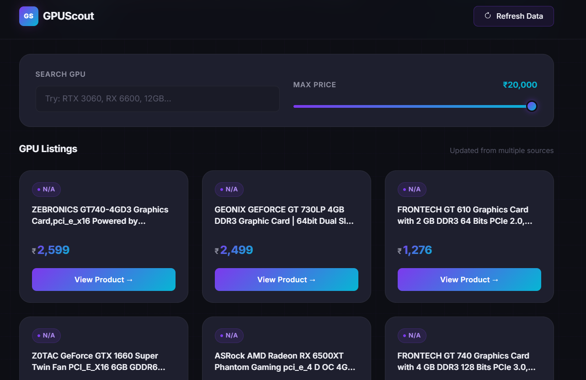

# GPUScout

GPUScout is a lightweight Flask web app for browsing budget graphics cards under a fixed price ceiling. It combines fast keyword search, a live max-price slider, and a simple JSON-backed data flow to help users compare GPU listings quickly.

## App Working Image


## Overview

The app loads preprocessed GPU listings from `data/graphic_cards.json`, renders them in a responsive Bootstrap interface, and lets users filter results instantly on the client side and through JSON endpoints. It is designed for quick discovery rather than full e-commerce checkout.

## Features

- Live keyword search across GPU titles and descriptions
- Adjustable max-price filter from `₹5,000` to `₹20,000`
- Refresh action to reload the current dataset
- Responsive card layout with a dark, modern UI
- JSON endpoints for programmatic access to product data

## Project Structure

```text
Simple-GPU-Finder/
├── app.py
├── scraper.py
├── Procfile
├── requirements.txt
├── README.md
├── data/
│   ├── scraping.json
│   └── graphic_cards.json
├── static/
│   ├── css/style.css
│   └── js/app.js
└── templates/
    ├── base.html
    └── index.html
```

## Tech Stack

| Layer | Technology |
|---|---|
| Backend | Python, Flask, Jinja2 |
| Frontend | HTML, CSS, JavaScript |
| UI | Bootstrap 5 |
| Data | JSON files |

## How It Works

1. `scraper.py` reads the raw input file in `data/scraping.json`.
2. It transforms the data into a cleaned GPU list and writes `data/graphic_cards.json`.
3. `app.py` loads the JSON file and serves the homepage, search endpoint, and product API.
4. `static/js/app.js` handles live search, price filtering, and refresh actions.

## API Endpoints

| Method | Endpoint | Description |
|---|---|---|
| GET | `/` | Render the main GPU listing page |
| GET | `/api/products` | Return all products as JSON |
| GET | `/search?q=<term>&max_price=<n>` | Return filtered products as JSON |
| POST | `/refresh` | Trigger a dataset refresh response |

### Example search request

```bash
GET /search?q=rtx&max_price=15000
```

### Example API response

```json
[
  {
    "title": "ZOTAC Gaming GeForce RTX 3050 6GB",
    "description": "NVIDIA powered GPU with 6GB GDDR6 memory.",
    "price": 14999,
    "source": "Amazon",
    "link": "https://www.amazon.in/..."
  }
]
```

## Setup

### 1. Clone the repository

```bash
git clone https://github.com/Ankit-euphemism/Simple-GPU-Finder.git
cd Simple-GPU-Finder
```

### 2. Create a virtual environment

```bash
python -m venv .venv
```

### 3. Activate it

Windows:

```bash
.venv\Scripts\activate
```

macOS / Linux:

```bash
source .venv/bin/activate
```

### 4. Install dependencies

```bash
pip install -r requirements.txt
```

### 5. Regenerate the dataset if needed

```bash
python scraper.py
```

### 6. Run the app

```bash
python app.py
```

Then open:

```text
http://localhost:5000
```

## Notes

- The current app name in the UI is GPUScout.
- The refresh button in the UI currently returns a success response and reloads the page; it does not trigger a live scrape yet.

## License

This project is open-source and no license is specified.
